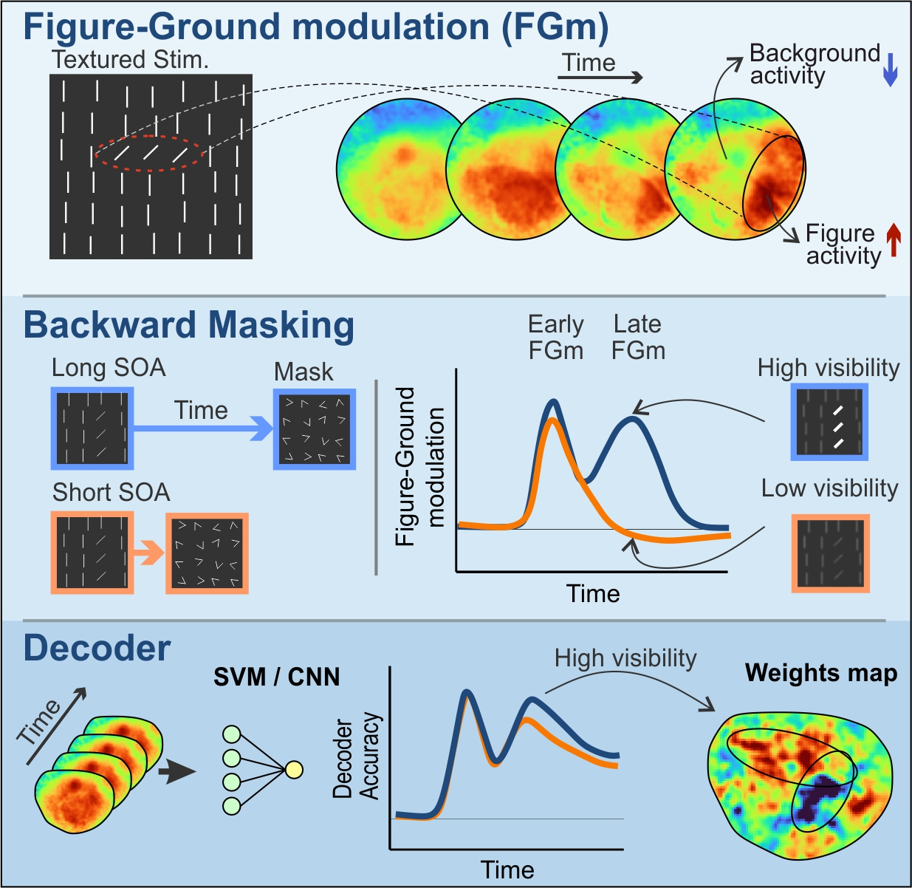

# Population responses in V1 encodes stimulus visibility in backward masking

This project contains all data, analysis code, and supplementary materials for the research article:
"Population responses in V1 encodes stimulus visibility in backward masking" by Dennis et al.

## Abstract
This study investigates the neural mechanisms underlying backward masking (BM) using voltage-sensitive dye imaging (VSDI) in macaque primary visual cortex (V1).
Two monkeys were trained on a texture discrimination task where briefly presented oriented targets were followed by masks at varying stimulus-to-mask onset asynchronies (SOA).
The research reveals that masks interfere with figure-ground modulation in V1, particularly affecting late-phase neural processing (~200ms post-stimulus) that correlates with stimulus visibility and behavioral performance.

## Key Findings
- Behavioral performance decreases and reaction times increase with shorter SOAs
- Figure-ground modulation (FGm) in V1 shows reduced amplitude for short SOAs at late processing times
- Support Vector Machine (SVM) classification reveals spatial reorganization of informative neural activity
- Early feedforward processing (~80-100ms) remains intact across all SOAs
- Late feedback-dependent processing (~180-200ms) is disrupted by masking, correlating with reduced stimulus visibility

## Experimental Methods
- **Subjects**: Two adult male macaque monkeys (Macaca fascicularis)
- **Technique**: Voltage-sensitive dye imaging (VSDI) at 100Hz temporal resolution and 170²μm²/pixel spatial resolution
- **Task**: Texture discrimination with pattern backward masking paradigm
- **Stimuli**: Oriented line segments forming horizontal or vertical targets embedded in textured backgrounds
- **SOA conditions**: 50, 75, 100, and 150ms intervals between stimulus and mask onset

## Directory Structure

### behaviour_files/
Contains CSV files with behavioral performance data for each monkey, recording session, and experimental condition, including:
- Trial id
- Presented stimuli: 2 = vertical, 3 = blank, 4 = horizontal
- RSD name
- Animals behaviour according to camera
- Hit(1) / false(0)
- Noisy recordings
- Reaction time (ms)
- Eye movements

### codes_for_figures/
MATLAB scripts (compatible with R2021) for reproducing all figures from the main article and supplementary materials, including:
- Behavioral performance analysis
- VSD signal processing and visualization
- Figure-ground modulation calculations
- SVM classification analysis
- Statistical comparisons and correlation analyses

### data/
#### BM/ (raw and processed data)
- Raw voltage-sensitive dye imaging data from backward masking experiments

#### normalized2_regist/ (preprocessed for SVM)
- Spatially registered VSD maps aligned across recording sessions
- Z-score normalized data prepared for machine learning analysis
- Balanced datasets for horizontal and vertical stimulus conditions

#### Figure-Ground data/
- Preprocessed data for figure-ground modulation analysis
- ROI definitions for target and background regions
- Time-course data for FGm calculations

### functions/
Utility functions and analysis tools required for data processing and figure generation, including:
- VSD signal preprocessing functions
- ROI definition and mapping utilities
- Statistical analysis functions
- SVM training and testing algorithms

## Citation
If you use this data or code, please cite:
Dennis, I., Edelman-Klapper, H., Raveh-Gadi, G., Bar-Shira, O., Margalit-Nivinsky, S., & Slovin, H. "Population responses in V1 encodes stimulus visibility in backward masking." bioRxiv (2025).

## Contact
For questions about the data or analysis methods, contact the corresponding author:
Hamutal Slovin (Hamutal.Slovin@biu.ac.il)
The Gonda Multidisciplinary Brain Research Center, Bar-Ilan University, Israel

## Requirements
- MATLAB R2021 or later
- Statistics and Machine Learning Toolbox
- Signal Processing Toolbox

